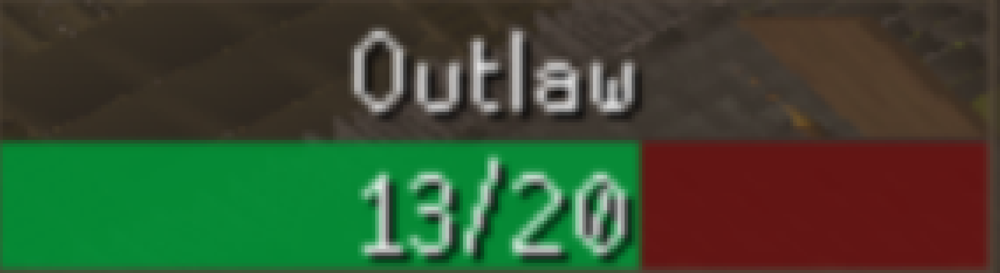

## Goals

This small project aims to periodically take screenshots from the runescape game and analyze if you are in combat. If
you start combat it will note down the time it takes you to kill whatever you are killing. This would be saved to a log
file and could be expanded to calculate kills per hour and profit per hour.

## Achievements
We reached the first milestone. With the addition of the Screenshot class the script is now able to "see".
The following "raw" picture

  

was converted to this simplified form.

  

Using the text method we got

  

which is exactly what we wanted.

## Todos

- [X] Get screenshots from specific part of the screen
- [X] Filter screenshot to only white (increases readability?)
- [ ] Analyze for enemy name (?) and health left (?) with ~~easyocr~~ pytesseract
- [ ] ~~Alternatively just look for the colors inside the healthbar~~
- [ ] Make a log class
- [ ] Make a monster class
- [ ] Add docstrings everywhere
- [ ] Add docstrings to Duration class
- [ ] Add check function to test if values are valid for Duration class
- [ ] Add text analyse for text from screenshot
- [ ] Add list of all (?) monsters to go through and get health
- [ ] Add extra analyse for hits to enemy and hits to yourself?